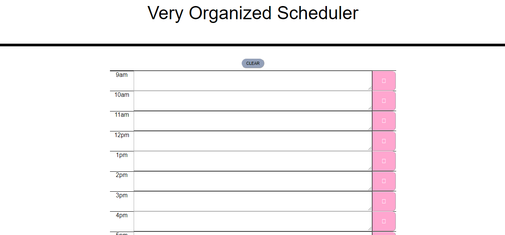

# VeryOrganizedScheduler
# VeryOrganizedScheduler.github.io
Unit 5 Day Planner

FINAL DEPLOYED APPLICATON:
https://violetshirokuma.github.io/VeryOrganizedScheduler.github.io/

<h2>Screenshot:</h2>

<h2>Description:</h2>

This Coding Quiz application was built with HTML, CSS, Javascript, Bootstrap, and Jquery. This calendar schedule application lets the user write in a text area for each hour of the day between 9am-5pm. 

<h2>Learning Process: </h2>

Jquery was utilized in order to create working syntax for the right layout and functions of the page.

<h2>Difficulties/Challenges:</h2>

* Creating a functioning save and clear function for the app.

* Styling the design/CSS portions of the scheduler.
